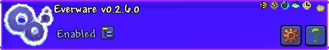

<table>
    <tr>

[//]: # (Header abuse to constuct my name vertically)
        <th valign="top" rowspan="3">
            <h1>
                I 
                N 
                K 
                • 
                Z 
                O 
                E 
                Y 
                ✦ 
                ✦
            </h1>
        </th>
        <th valign="center" align="left">
            THE BOOKSHELF
        </th>

[//]: # (Right end of the bookshelf)
        <th rowspan="3"/>
    </tr>
    <tr>
        <td valign="bottom">
            <table>
                <tr>

[//]: # (Obvious gold-meridian reference)
                    <th>
                        OF THE >HORIZON
                    </th>

[//]: # (Mysterious vague header, TODO: fill out section with 8 misc mods)
                    <th>
                        8 STOOD SOLUMNLY; >FORLORN
                    </th>

[//]: # (vro thinks im gonna create ANY vague alias of rosemary in english lmao)
                    <th>
                        ?????
                    </th>
                </tr>

[//]: # (Mod panels are provided with accompanying Elklang name for my Elkfolk lurkers out there)
                <tr>
                    <td valign="bottom">
                        <table align="center">
                            <tr>
                                <td valign="center" align="left">
                                    <a href="https://github.com/gold-meridian/daybreak-mod" title="DAYBREAK">
                                        
                                    </a>
                                </td>

[//]: # (Elklang defintion of Daybreak is a starburst, and reportedly the first Daybreak fanart)
                                <td valign="center" align="left" width="135">
                                    <picture valign="center">
                                        <source media="(prefers-color-scheme: dark)" srcset="DAYBREAK_DEFINITION_DARK.png">
                                        <source media="(prefers-color-scheme: light)" srcset="DAYBREAK_DEFINITION_LIGHT.png">
                                        
                                    </picture>
                                </td>
                            </tr>
                        </table>
                        <table align="center">
                            <tr>

[//]: # (Elklang defintion of Radiant Revival is a bit more abstract but features a moon,
perhaps in reference to the 3D Moons that I've yet to work on 👁️)
                                <td valign="center" align="right" width="135">
                                    <picture valign="center">
                                        <source media="(prefers-color-scheme: dark)" srcset="RADIANT_REVIVAL_DEFINITION_DARK.png">
                                        <source media="(prefers-color-scheme: light)" srcset="RADIANT_REVIVAL_DEFINITION_LIGHT.png">
                                        
                                    </picture>
                                </td>
                                <td valign="center" align="right">
                                    <a href="https://github.com/gold-meridian/radiant-revival" title="Radiant Revival">
                                         
                                    </a>
                                </td>
                            </tr>
                        </table>
                    </td>
                    <td valign="bottom">
                        <table width="100%" align="center">
                            <tr>
                                <td valign="center" align="left">
                                    <a href="https://github.com/energykid/Everware" title="Everware">
                                        
                                    </a>
                                </td>

[//]: # (Elklang defintion of Everware is more vague, and lacks a unique symbol,
the characters wrapped in brackets could perhaps be in reference to the content variety???
Unsure, I'm kinda grasping at straws, perhaps could be redone to feature the meteor visual I made recently?)
                                <td valign="center" align="left" width="135">
                                    <picture valign="center">
                                        <source media="(prefers-color-scheme: dark)" srcset="EVERWARE_DEFINITION_DARK.png">
                                        <source media="(prefers-color-scheme: light)" srcset="EVERWARE_DEFINITION_LIGHT.png">
                                        
                                    </picture>
                                </td>
                            </tr>
                        </table>
                    </td>
                    <td valign="bottom">
                        <table width="100%" align="center">
                            <tr>
                                <td valign="center" align="left">
                                    <a href="https://github.com/swirlier-ink/rosemary" title="𝚛𝚘𝚜𝚎𝚖𝚊𝚛𝚢">
                                        
                                    </a>
                                </td>
                            </tr>
                        </table>
                    </td>
                </tr>
            </table>
        </td>
    </tr>
    
[//]: # (Short story carved into the bottom of the bookshelf, could it mean anything? Well, I guess?
❧ '…even trees can bleed…' likely a reference to her many carvings in the forest, she doesn't let the ink dry)
    <tr>
        <td valign="center" align="right">
            …with aspirations like that…                    
            …even trees can bleed…    
            …you'll share your story with us, won't you?      
        </td>
    </tr>
</table>

[//]: # (Best thing I've ever done lowkey)

